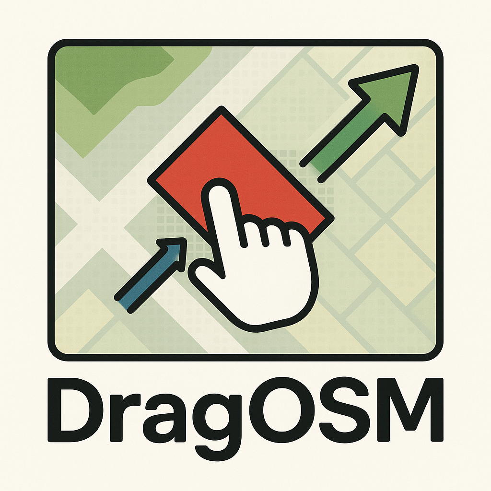

<a name="readme-top"></a>

<!-- PROJECT LOGO -->
<br />
<div align="center">
  
  <h2 align="center">DragOSM: Extract Building Roofs and Footprints from Aerial Images by Aligning Historical Labels</h2>
  <p align="center">
    Official codebase for DragOSM paper.<br>
    <a href="https://arxiv.org/abs/2509.17951">[Paper]</a> | <a href="https://github.com/likaiucas/DragOSM">[Project HomePage]</a>
    <br>
    <i>DragOSM: Interactive Label Correction for Off-Nadir Aerial Imagery</i>
  </p>
</div>

---

## Table of Contents

- [About DragOSM](#about-dragosm)
- [Key Contributions](#key-contributions)
- [Installation](#installation)
- [Dataset: ReBO](#dataset-rebo)
- [Dataset Annotator](#dataset-annotator)
- [Quick Start](#quick-start)
- [License](./LICENSE)
- [Citation](#citation)
- [Contact](#contact)

---

## About DragOSM

DragOSM is a new framework to accurately align and correct building roof and footprint labels in off-nadir (oblique) aerial images, especially where historical labels (e.g., from OpenStreetMap) are outdated or spatially misaligned. Our method formulates label correction as an interactive "dragging" process, introducing the novel concept of the **Alignment Token**, and adopts denoising training to robustly learn spatial offsets.

## Future Direction
As an emerging research direction, I will introduce more potential research directions here after acceptance. 


For more details, see our paper:  
**DragOSM: Extract Building Roofs and Footprints from Aerial Images by Aligning Historical Labels**

---

## Key Contributions

- **Problem Transformation:**
  We reformulate polygonal building extraction as a task of aligning historical labels with the remote sensing imagery, thereby enabling a unified method that performs effectively on both near-nadir and off-nadir imagery.

- **Alignment Token & Interactive Label Correction:**  
  We introduce the *alignment token* concept and formulate historical label correction as a two-step interactive dragging process for off-nadir images, solving the mismatch between outdated labels and current imagery.

- **Denoising Training & Inference Scheme:**  
  DragOSM uses dynamic Gaussian noise to simulate label displacements during training and learns to iteratively denoise and align annotations. DragOSM interprets the positional perturbation of OSM labels as a Gaussian process centered at the ground truth, rather than starting from structureless noise as in diffusion-based approaches. During multi-step inference, the correction process is modeled as the cumulative effect of Gaussian process differences.

- **ReBO: A New Benchmark Dataset:**  
  We curated the Repairing Buildings in OSM (ReBO) dataset with over 179,000 buildings and detailed instance-level polygon corrections (roof, footprint, OSM) across 41 cities.

- **Strong Empirical Performance:**  
  DragOSM achieves state-of-the-art results on label alignment tasks, outperforming both extraction-based and prompt-based baselines in both accuracy and robustness.

---

## Installation

**DragOSM** is built upon [MMDetection](https://github.com/open-mmlab/mmdetection) and reuses parts of [BONAI](https://github.com/jwwangchn/BONAI).  
**Please follow the official installation guides for these dependencies:**

- [BONAI Installation Guide](https://github.com/jwwangchn/BONAI)
- [MMDetection Installation](https://github.com/open-mmlab/mmdetection)

Make sure you are using a compatible environment (e.g., PyTorch 1.7+, CUDA 11.1+, Python 3.8+) and properly install all dependencies.

```bash
# Example (do not run as-is, refer to official docs for details)
conda create -n dragosm python=3.8
conda activate dragosm
pip install torch torchvision
# Install MMDetection and BONAI following their instructions
```
# Dataset ReBO
The dataset and statistics are avaliable with [Onedrive](https://portland-my.sharepoint.com/:u:/g/personal/kaili37-c_my_cityu_edu_hk/ETeEjpTKErlHhZPMriO_SkQBk8RPiFXlHFpMXvQd2oQ3ZQ?e=g9ba1g) and [BaiduDisk](https://pan.baidu.com/s/1UGk4WFC6zlUUyvLQycGfkw?pwd=hs6s).

# Dataset Annotator
We provide the annotator which can revise OSM data and review the predictions of DragOSM. You may find it [here](./annotator). 


# Quick Start
The descriptions for training and test are included in the default configs. 
```bash
# To Train
bash tools/dist_train.sh configs/DragOSM/dragosm_vit_b_osmrand_intensity_snd_512_omni_ISRA_200.py
# TO Test
python test_offset.py
```
# Citation
```
@misc{li2025dragosm,
      title={DragOSM: Extract Building Roofs and Footprints from Aerial Images by Aligning Historical Labels}, 
      author={Kai Li and Xingxing Weng and Yupeng Deng and Yu Meng and Chao Pang and Gui-Song Xia and Xiangyu Zhao},
      year={2025},
      eprint={2509.17951},
      archivePrefix={arXiv},
      primaryClass={cs.CV},
      url={https://arxiv.org/abs/2509.17951}, 
}
```
